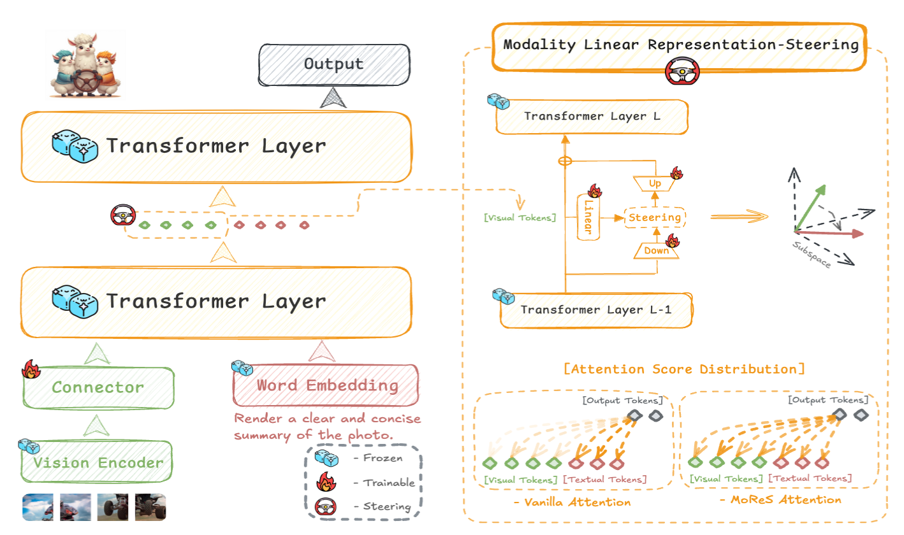
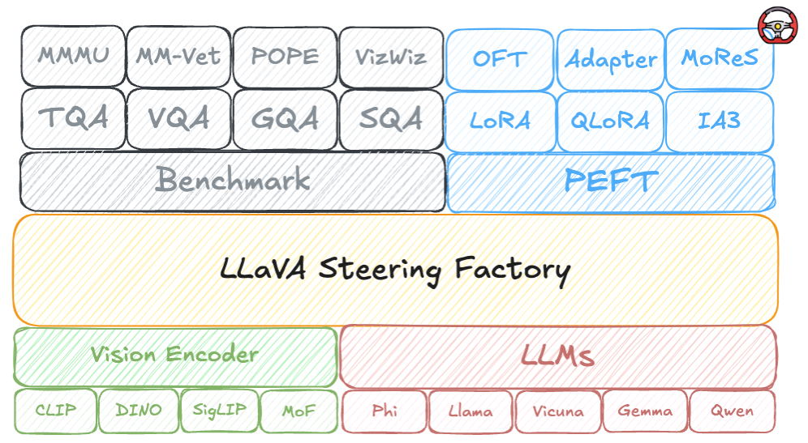

<div align="center">
<h1>LLaVA-Steering </h1>
<h3>Visual Instruction Tuning with 500x Fewer Parameters through Modality Linear Representation-Steering</h3>
<div>
    <h4 align="center">
        <a href=''></a>
    </h4>
</div>
</div>

## News
* **` Dec. 16rd, 2024`**: We release paper for LLaVA-Steering.
* Code will be released asap after internal review.

## Abstract
Multimodal Large Language Models (MLLMs) have significantly advanced visual tasks by integrating visual representations into large language models (LLMs). The textual modality, inherited from LLMs, equips MLLMs with abilities like instruction following and in-context learning. In contrast, the visual modality enhances performance in downstream tasks by leveraging rich semantic content, spatial information, and grounding capabilities. These intrinsic modalities work synergistically across various visual tasks.
Our research initially reveals a persistent imbalance between these modalities, with text often dominating output generation during visual instruction tuning. This imbalance occurs when using both full fine-tuning and parameter-efficient fine-tuning (PEFT) methods. We then found that re-balancing these modalities can significantly reduce the number of trainable parameters required, inspiring a direction for further optimizing visual instruction tuning. Hence, in this paper, we introduce Modality Linear Representation-Steering (MoReS) to achieve the goal. MoReS effectively re-balances the intrinsic modalities throughout the model, where the key idea is to steer visual representations through linear transformations in the visual subspace across each model layer. 
To validate our solution, we composed LLaVA Steering, a suite of models integrated with the proposed MoReS method. Evaluation results show that the composed LLaVA Steering models require, on average, 500 times fewer trainable parameters than LoRA needs while still achieving comparable performance across three visual benchmarks and eight visual question-answering tasks.
Last, we present the LLaVA Steering Factory, an in-house developed platform that enables researchers to quickly customize various MLLMs with component-based architecture for seamlessly integrating state-of-the-art models, and evaluate their intrinsic modality imbalance. This open-source project enriches the research community to gain a deeper understanding of MLLMs.
<p align="center">
  
</p>


## Installation

**Step 1: Clone LLaVA-Steering repository:**

```bash
git clone https://github.com/bibisbar/LLaVA-Steering.git
cd LLaVA-Steering
```

**Step 2: Environment Setup:**

***Create and activate a new conda environment***

```bash
conda create -n LLaVASteering
conda activate LLaVASteering
```

***Install Dependencies***


```bash
pip install -r requirements.txt
```


## Quick Start

### 1. Datasets Preparation

Please refer to the [Data Preparation](https://huggingface.co/datasets/liuhaotian/LLaVA-Instruct-150K/blob/main/llava_v1_5_mix665k.json) section in LLaVA [Documenation](https://github.com/haotian-liu/LLaVA).

### 2. Train
#### Pretraining
#### Visual Instruction Tuning
The scripts will be released shortly after completing the code cleaning process.
### 3. Evaluation
The scripts will be released shortly after completing the code cleaning process.

## Custom Your MLLM!
In the LLaVA Steering Factory, we establish standardized training and evaluation pipelines, along with flexible data preprocessing and model configurations. Our framework allows researchers to easily customize their models with various training strategies without the need for additional coding. We implement all mainstream LLMs and vision encoders, including multiple PEFT methods and our proposed MoReS technique. Furthermore, we support a wide range of benchmarks and integrate our intrinsic modality imbalance evaluation. The goal of the LLaVA Steering Factory is to facilitate research in MLLMs, particularly in addressing intrinsic modality imbalance to optimize visual instruction tuning.
<p align="center">
  
</p>

### Model Zoo
which are trained using LLaVA Steering Factory.
### Train Recipe

The scripts will be released shortly after completing the code cleaning process.

## Contact
If you have any questions, feel free to either initiate an *Issue* or contact us by email (*bijinhe@outlook.com*).

## ❤️ Community efforts
* Our codebase is built upon the [LLaVA](https://github.com/haotian-liu/LLaVA) and [TinyLLaVA_Factory](https://github.com/TinyLLaVA/TinyLLaVA_Factory?tab=readme-ov-file). Great work!
